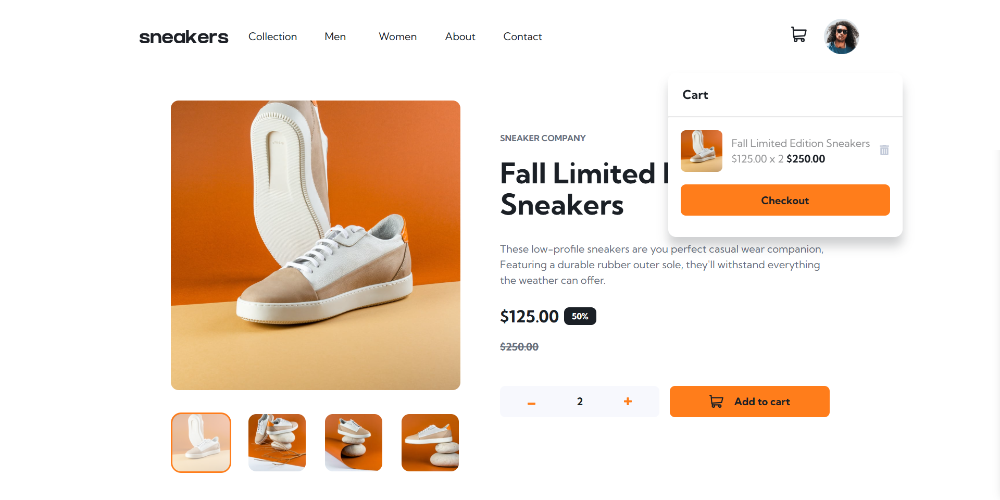

# Ecommerce Product Page 

This project is an implementation of an e-commerce product page, built as a challenge from Frontend Mentor. The main goal was to practice state management using Redux Toolkit while ensuring the UI closely matches the given design.

🚀 Features

📸 Lightbox Gallery: Users can open a lightbox gallery by clicking on the large product image.

🔄 Image Switching: Clicking on thumbnail images updates the main product image.

🛒 Cart Functionality: Users can add products to the cart, view the cart, and remove items from it.

📱 Responsive Design: Optimized for different screen sizes to ensure a great user experience.

🎨 Interactive UI: Hover states for interactive elements enhance usability.

🛠️ Technologies Used

React.js - Component-based UI development

Redux Toolkit - State management for cart and UI interactions

CSS - Styling for responsiveness and design accuracy

📸 Screenshots

